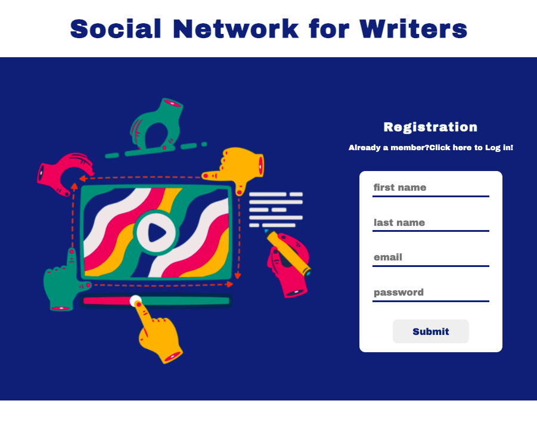

# Social Network for writers

A social network for writers with a personal profile, image upload, sending, receiving and accepting friend requests, real-time chat, collaborative whiteboard and a collaborative texteditor.

# Technologies:
React, Redux, Canvas, Node, PostgreSQL, Socket.IO, AWS S3, an extension of the texteditor with slate.js is in progress.

# Socialnetwork - GIF:
A GIF is coming soon. I will expand the functionality of the texteditor and I'm working on some style-changes.
